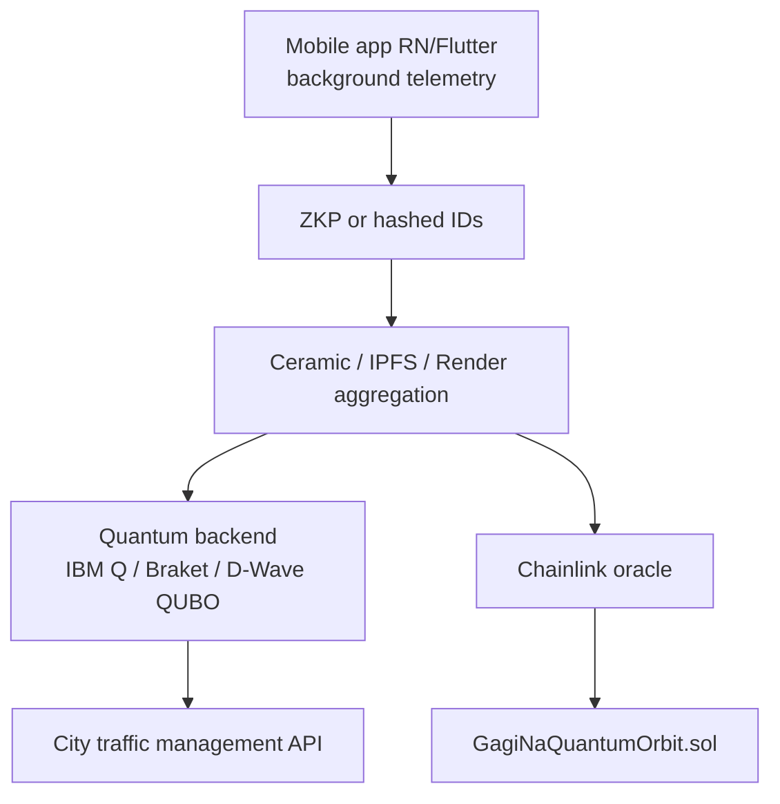

# 🌌 GAGI NA QUANTUM ORBIT

> *Your people on the city's quantum orbit*

**SEABW 2026 Vibe Coding Hackathon** — Southeast Asia Web3 · Bangkok / Ho Chi Minh

GAGI NA QUANTUM ORBIT is a decentralized traffic optimization platform combining **quantum-inspired signal control** and **Web3 incentives**. Drivers earn **ORBIT** tokens for sharing anonymous movement data; the orbital engine adapts intersection phases in real time, targeting **20–30%** congestion reduction without building new roads.

| | |
|---|---|
| 🔗 **Live demo** | `https://gagi-orbit-web.onrender.com` *(set after Render deploy)* |
| 📡 **API** | `https://gagi-orbit-api.onrender.com` |
| 📄 **Smart contract (Amoy)** | Set `VITE_CONTRACT_ADDRESS` after deploy — see [Contracts](#smart-contract) |
| 🏆 **Hackathon** | SEABW 2026 |

---

## Problem

Urban congestion is a daily crisis:

- **Bangkok** — among the world's worst traffic (TomTom Index); ~57% extra travel time, up to 114% at peak; ~97M THB/day in wasted fuel.
- **Hanoi & Ho Chi Minh** — critical network density; authorities prioritize congestion as a top economic blocker.
- **Moscow & Russian megacities** — top European congestion; ~127 hours/year lost per driver.

Fixed traffic-light cycles cannot solve an **NP-hard** coordination problem at city scale.

## Solution

| Layer | Role |
|-------|------|
| **Drivers (Gagi Na — "your people")** | Share anonymized speed/location; earn ORBIT |
| **Quantum Orbit engine** | QUBO-style optimization (simulated annealing MVP; Qiskit/Braket in production) |
| **Web3** | `GagiNaQuantumOrbit.sol` mints rewards via trusted backend oracle (Chainlink in pilot) |
| **Digital twin (MVP)** | Canvas intersection demo — fixed cycle vs Quantum Orbit |

Research from Innopolis / Q Deep (*Nature Scientific Reports*, 2025) shows quantum methods can accelerate traffic flow optimization — this project is the hackathon-ready productization of that direction.

---

## How real vehicles join the network

### MVP (this repo — hackathon demo)

```mermaid
flowchart LR
  A[Driver taps<br/>"I'm on the road"] --> B{Geolocation API<br/>or simulated GPS}
  B --> C[POST /api/join-orbit]
  C --> D[Quantum Orbit engine<br/>queue + phases]
  C --> E[SQLite leaderboard<br/>+5 ORBIT demo]
  D --> F[Canvas simulator<br/>updates queues]
```

1. User connects **MetaMask** (Polygon Amoy).
2. Clicks **"I'm on the road right now"**.
3. Browser sends `{ wallet, lat, lng, speed }` to the API.
4. Backend maps position to nearest approach (demo coords near Bangkok) and increments queue.
5. Participant table and ORBIT balance update (demo ledger; on-chain when contract is deployed).

### Production pilot (roadmap)



---

## Tech stack

| Component | Stack |
|-----------|--------|
| Frontend | React 18, Vite, TailwindCSS, **Deck.gl + MapLibre**, ethers.js v6 |
| Map data | Bangkok Sukhumvit demo graph (12 nodes, 15 edges); production: OSM + pgRouting |
| Backend | Node.js, Express, better-sqlite3 |
| Optimizer | QUBO-inspired simulated annealing (`backend/src/quantumOptimizer.js`) |
| Contract | Solidity 0.8.20, Hardhat, Polygon Amoy testnet |
| Deploy | Render (web service + static site) |

---

## Project structure

```
GAGI-NA-QUANTUM-ORBIT/
├── backend/          # Express API + quantum optimizer + SQLite
├── frontend/         # SPA demo UI
├── contracts/        # GagiNaQuantumOrbit.sol + Hardhat
├── render.yaml       # Render Blueprint
└── README.md
```

---

## API endpoints

| Method | Path | Description |
|--------|------|-------------|
| `POST` | `/api/join-orbit` | `{ wallet, lat, lng, speed }` → tokens + queue update |
| `GET` | `/api/queue-state` | Current intersection queues & phases |
| `POST` | `/api/quantum-optimize` | Run optimizer, return new phases |
| `POST` | `/api/mode` | `{ mode: "fixed" \| "quantum" }` |
| `POST` | `/api/tick` | Advance simulation one step |
| `GET` | `/api/leaderboard` | Top participants by ORBIT (demo) |
| `GET` | `/api/metrics/history` | Chart data (fixed vs quantum queues) |
| `GET` | `/api/activity` | Demo on-chain style activity feed |
| `POST` | `/api/faucet` | Test ORBIT for demo wallets |
| `POST` | `/api/feed-flock` | Spend 10 ORBIT → flock speed boost |
| `POST` | `/api/inject-traffic` | Add fake rocket-ducks |
| `POST` | `/api/reset-demo` | Reset queues + metrics |
| `POST` | `/api/scenario` | Load Bangkok / Hanoi / quantum scenarios |
| `GET` | `/api/map/graph` | Road graph + districts (Bangkok demo) |
| `GET` | `/api/map/state` | Vehicles, flows, edge load, signals |
| `POST` | `/api/map/tick` | Advance map simulation |
| `GET` | `/health` | Health check for Render |

---

## Local development

### Prerequisites

- Node.js 18+
- MetaMask (optional, for wallet UI)
- Polygon Amoy test POL (optional, for contract deploy)

### Backend

```bash
cd backend
cp .env.example .env
npm install
npm run dev
# → http://localhost:3001
```

**Port 3001 already in use?** (from a previous `npm run dev`):

```powershell
# From repo root (Windows)
.\scripts\free-port.ps1
# Or use another port:
$env:PORT=3002; npm run dev
```

### Frontend

```bash
cd frontend
cp .env.example .env
# VITE_API_URL=http://localhost:3001
npm install
npm run dev
# → http://localhost:5173
```

### Smart contract

```bash
cd contracts
cp .env.example .env   # DEPLOYER_PRIVATE_KEY, POLYGON_AMOY_RPC
npm install
npx hardhat compile
npm run deploy:amoy
```

Copy deployed address to:

- `frontend/.env` → `VITE_CONTRACT_ADDRESS=0x...`
- `backend/.env` → `CONTRACT_ADDRESS=0x...` (for future oracle signer)

---

## Deploy on Render

1. Push repo to GitHub.
2. **Dashboard → New → Blueprint** and select `render.yaml`, or create two services manually:

| Service | Type | Root | Build | Start / Publish |
|---------|------|------|-------|-----------------|
| `gagi-orbit-api` | Web | `backend` | `npm install` | `npm start` |
| `gagi-orbit-web` | Static | `frontend` | `npm install && npm run build` | `dist` |

3. **API env:** `CORS_ORIGINS=https://your-frontend.onrender.com`, mount disk at `/var/data` for SQLite persistence.
4. **Frontend env:** `VITE_API_URL=https://gagi-orbit-api.onrender.com`, `VITE_CONTRACT_ADDRESS`, `VITE_GITHUB_URL`.

Health check: `GET /health`

---

## Demo / testing checklist

1. Open frontend URL.
2. **Test Wallets** panel → generate wallet or use preset ducks (1000 ORBIT demo).
3. **Connect Wallet** (MetaMask; Polygon Amoy) — optional if using test wallets.
4. **Start traffic** → toggle **Quantum Orbit** → purple flash, quantum tunnel, queue graph drops.
5. **I'm on the road** → flying duck animation + ORBIT tokens + leaderboard update.
6. **Feed the flock** (−10 ORBIT) → ducks jump, yellow feed particles.
7. **Demo controls** → inject traffic, scenarios, export CSV, quantum noise slider.
8. `curl http://localhost:3001/api/leaderboard`

### Why ducks on rockets?

**Gagi Na** = your own people. Ducks are loyal and stick together — like our driver community. **Rockets** = the quantum leap in signal optimization. Every duck on the canvas is a driver earning ORBIT.

---

## Smart contract

**File:** `contracts/GagiNaQuantumOrbit.sol`

| Function | Access | Purpose |
|----------|--------|---------|
| `enterOrbit(address driver, uint256 dataPoints)` | `onlyBackend` | Mint ORBIT after validated telemetry |
| `claimReward()` | driver | Future voucher flow |
| `balanceOf(address)` | public | ERC20-style balance |

**Network:** Polygon Amoy (chainId `80002`)

**Contract address:** `0x...` *(paste after deploy)*

Explainer for judges: MVP uses a **centralized demo ledger** on the API plus optional on-chain mint via backend oracle; production decentralizes via Chainlink + ZKP attestations.

---

## Hackathon criteria mapping

| Criterion | Implementation |
|-----------|----------------|
| Real problem | Bangkok / SEA / Moscow congestion narrative + live intersection demo |
| Web3 | ORBIT token, MetaMask, Amoy contract |
| 24h prototype | Full SPA + API + contract scaffold |
| Vibe coding | Built with Cursor AI |
| Render deploy | `render.yaml` + health endpoint |

---

## Roadmap

| When | Milestone |
|------|-----------|
| **Aug 2026** | Skolkovo × TASCO "Smart City" application — Vietnam pilot proposal |
| **Nov 2026** | TASCO Build Week — Hanoi or HCMC pilot adaptation |
| **2027** | Russia pilots (Moscow CODD, SPb, Kazan) |
| **2028+** | SEA scale (Indonesia, Philippines), MENA, LATAM |

### Product modules (post-hackathon)

1. **Quantum-classical optimizer** — city-wide QUBO (D-Wave / Qiskit); local QAOA per intersection  
2. **ML traffic predictor** — LSTM + Transformer prototype  
3. **Green route generator** — hybrid routing + ORBIT rewards  
4. **City digital twin** — SUMO integration (lab-tested with quantum optimization)  
5. **Gagi Na privacy** — federated learning + quantum-blockchain V2X research track  

---

## Environment variables

See `backend/.env.example`, `frontend/.env.example`, `contracts/.env.example`.

**Never commit** private keys or production RPC secrets.

---

## License

MIT — SEABW 2026 hackathon submission.

**Tagline:** *Gagi Na Quantum Orbit — your people on the city's quantum orbit.*
